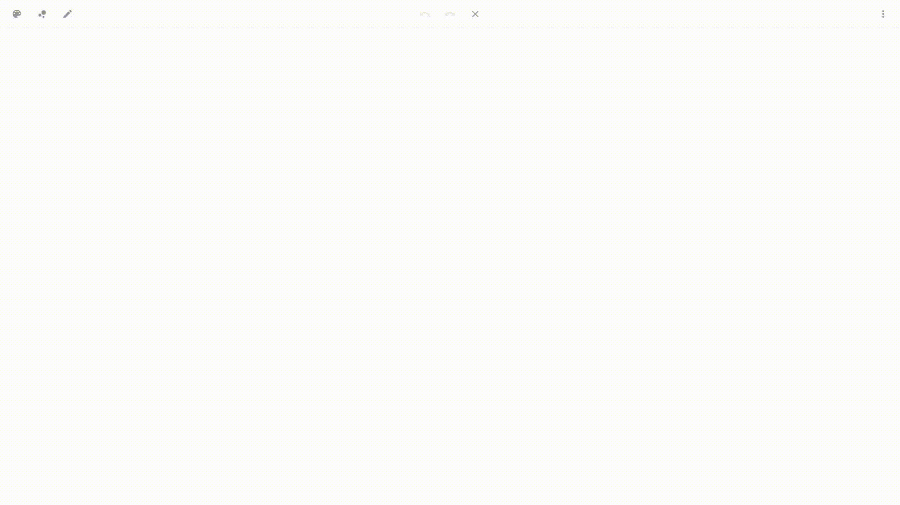

# Outline

Outline is a web-based drawing app that combines the latest features of the browsers of tomorrow.
 

### Visit [outline.typable.dev](https://outline.typable.dev) and start drawing now.
 

### Features

- **Minimalistic UI** 
Clean looking UI for fast navigation.

- **Touch and Pen Support** 
Makes it easy to draw on phone and tablet devices.

- **Dark Mode** 
More pleasant for your eyes.

- **Undo and Redo** 
Easily navigate through undo and redo steps.

- **Pencil Types** 
Currently available types are Pen, Marker and Eraser.

- **Multi Language Support** 
Available languages are English, German, French, and Chinese.

- **Capture** 
Download fullscreen and cropped drawings.
 

### Upcoming

- **PWA Support** `v1.2.0` 
Offline Support for Windows, Android and Chrome OS.

- **Multiplayer** 
Create, host, and join channels with others.

- **Gallery** 
Manage and navigate through your drawings.

- **Gamepad Support** 
Draw with your PlayStation, Xbox, and Stadia Controller.
 

### Information

- **No support for older Browsers** 
Outline was intentionally developed for new browsers, so functionality for older browsers cannot be guaranteed.
 

### Support

- **Donation** 
If you want to support this project with a small donation visit: [buymeacoffee.com/typable](https://www.buymeacoffee.com/typable)

- **Contribution** 
If you have an idea for a new feature or found a bug, get in touch with us: [outline/issues](https://github.com/typable/outline/issues/new/choose)
 
